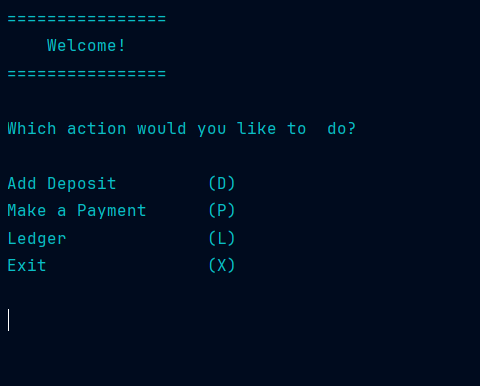
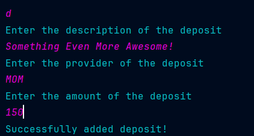
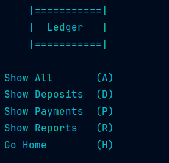

# Accounting Ledger Application

## Home screen

The home screen has multiple options that adds deposits, payments and are able to show your ledger

## Add deposit/payment

When adding deposit the program asks you for the description of the deposit,
the provider of the deposit,  and the amount of the deposit

# Ledger

## Show All

## Show All

## Show deposits/payments

# Reports

## Month to Date / Previous Month

## Year to Date / Previous Year

## Search by Vendor

# Custom Search

## Selected Date

## Description

## Amount 

## Multiple 